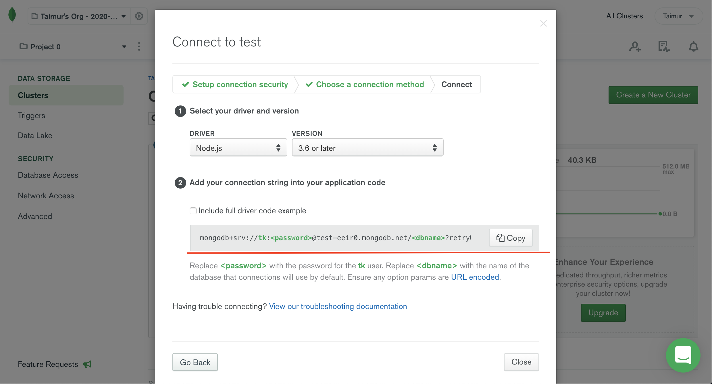
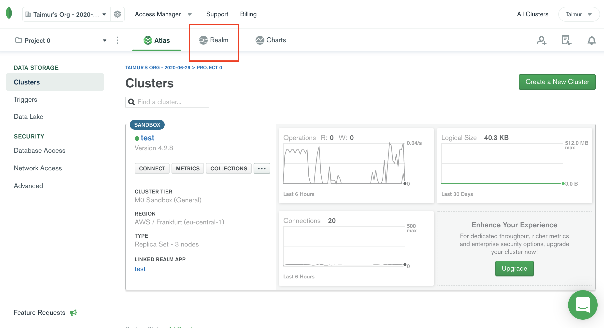
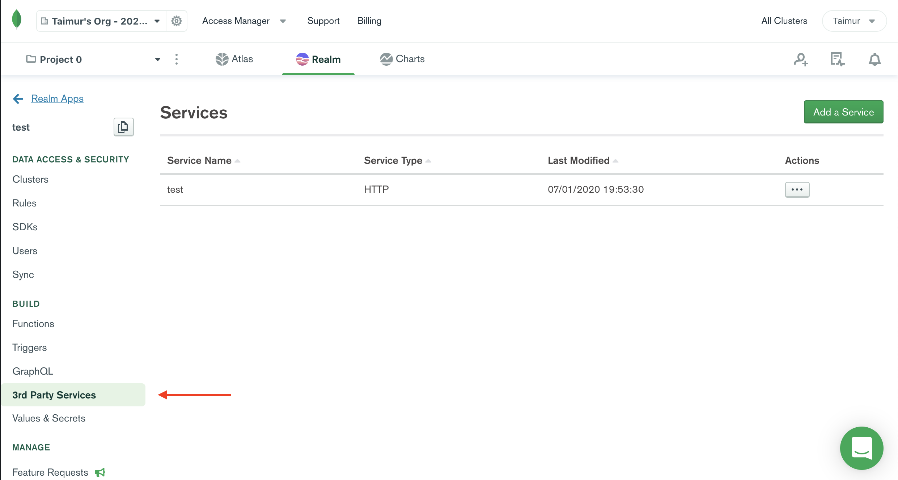
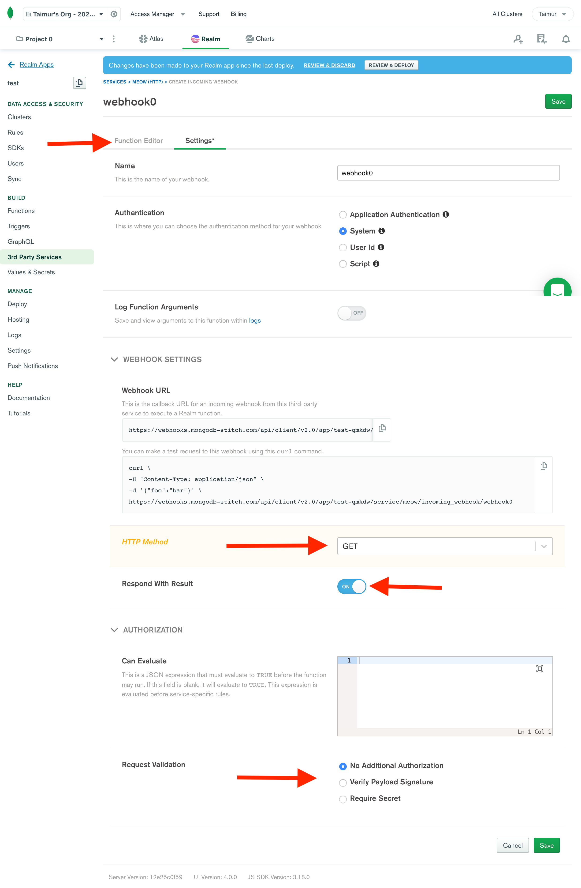
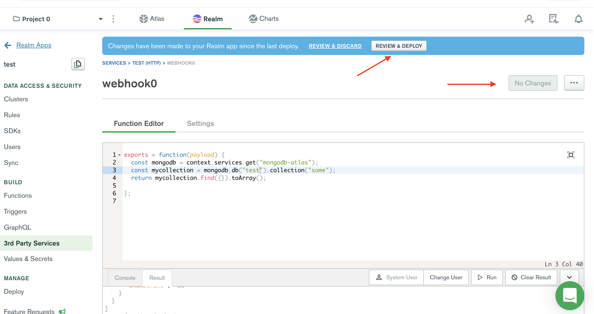
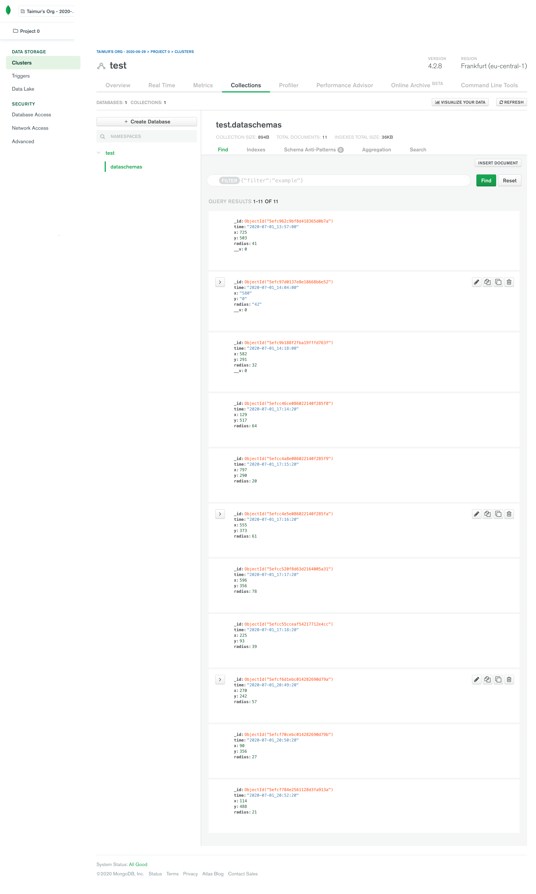
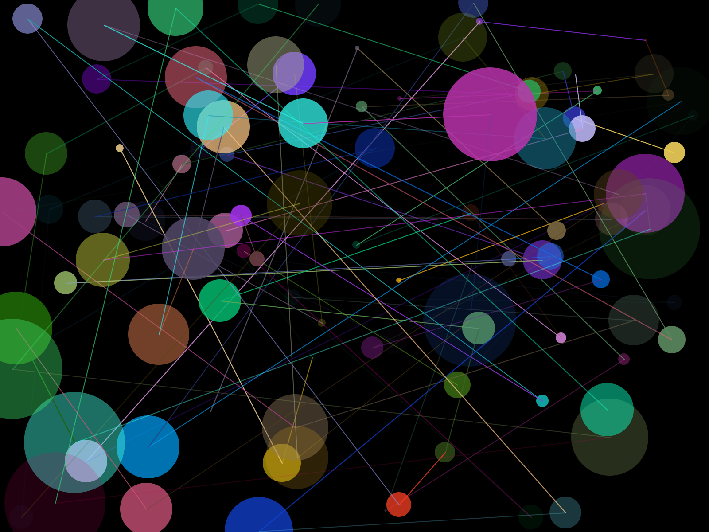

# Visualizing the Database

## Introduction
This project demonstrates how to develop a distributed communication and visualization system with Node.js, mongoDB, and P5.js. The system uses a Node.js client to generate data entries, which are then logged in a MongoDB library to our online database in MongoDB Atlas. Using an API (Application Programming Interface), we are able to visualize these entries on our client application with the use of P5.js.

---

## Database with MongoDB Atlas

For this work, [mongoDB](https://www.mongodb.com/what-is-mongodb) and [Mongo Atlas](https://cloud.mongodb.com) are used. MongoDB is a JSON-like database system, which makes it easy to work with many applications and frameworks (especially those developed with JavaScript). Atlas is a database-as-a-service with a range of features for quicker and efficient development. Here is a [tutorial](https://docs.atlas.mongodb.com/getting-started/) to get started with mongoDB and Atlas.

After setting up your free account with Atlas, the first thing you will do is to create a free cluster, a new database, a new collection, and a new user for the database. For the cluster, click the create Cluster button, then select AWS and Frankfurt,DE as a region (lets keep our data as close to us as possible). Also give your cluster a name. After the deployment process finishes, click on the "connect" tab and add the IP ***0.0.0.0/0*** to the whitelist IP field and enter a username and password for your connection (keep these somewhere safe, don't lose this info!). Click on "Choose a connection method" and then select the middle option "Connect Your Application" on the next step. Once done you will get a Connection String, as shown in the screenshot below. Copy and paste this string in a notepad somewhere. The next step is to create a new collection (under the **Collections** tab), and a new database  (if still confused, see [MongoDB Docs for stepwise instructions](https://docs.atlas.mongodb.com/getting-started/)) (Note: Add 0.0.0.0/0 as your whitelisted IP to allow access from all IPs). Finally, you need to to create an API end point to be able to access your data from your frontend/clientside. To do this, click on **Realm** button in the menu Above your cluster (see pic below).

<p align="center">

</p>
<p align="center">

</p>

Nest, create a new Realm app and then proceed to clicking on "Third-party services" in the side menu as shown below, then add a new service, choose HTTP, and give the service a name (anything works):

<p align="center">

</p>

Once your service is added, click on "Add Incoming Hook". Then proceed to the setting up your webhook as in the screenshot below, and then click on the "Function Editor" editor tab. ***Make sure to copy the Webhook URL and save it somewhere for later use.*** 

<p align="center">

</p>

Add the following code to the code editor, and make sure to add to replace the YOURDBNAME with the name of your database (you created earlier) and the collection where we will store all data. After this, click the green "save" button top right of the code editor and then make sure to click the "Review & and Deploy" button

```javascript
exports = function(payload) {
  const mongodb = context.services.get("mongodb-atlas");
  //replace YOURDBNAME and YOURCOLLECTIONNAME with your database and colelction names
  const mycollection = mongodb.db("YOURDBNAME").collection("YOURCOLLECTIONNAME");
  return mycollection.find({}).toArray();
};
```
<p align="center">

</p>

**That's it, your database and API are ready to go!**

---

## Node.js Client

To send new data to the database, Node.js will be used here as a client (note: this is not clientside). Make sure you have Node.js on your system - use Terminal (or Command Prompt) and the following command; this will return the current version of Node.js that is on your system. If your system does not have it, download it from [here](https://nodejs.org/en/). If you are not familiar with Node.js, check [this](https://codeburst.io/getting-started-with-node-js-a-beginners-guide-b03e25bca71b) for a getting started tutorial.

```Terminal
node -v
```
All dependencies for the Node.js project are include in the **node_modules** folder (in NodeJs-Timelog-MongoDB on GitHub), or they can be installed using the **package.json** file. Download the project from the GitHub, and use Terminal to navigate to this directory with cd (check [this link](https://macpaw.com/how-to/use-terminal-on-mac) if you are not familiar with the process). To install them from scratch, run the following in Terminal:

```Terminal
npm install
```

After we make sure that we have the necessary libraries (in this case the mongodb), we import the library into our **main.js** file. To establish communication with our database in Atlas, we have to use the mongo connection string (the connection string you copied earlier), provided in Atlas (as in photo above). The username and user password refer to the new User you added in your Atlas database (not the user account with MongoDB).

Following that, the function **getRandomInt()** generates a random number everytime that it is called, within a specified ranged (minimum to maximum). This is used later to generate values for the randomX, randomY, and randomRadius variables.

The last function used here is the **setInterval(function(){ ... }, 1000);** which creates a loop according to a timing value (in ms) that is set at the end of the closing parenthesis - in this case 1000. Thus, every second we generate new random values for the variables randomX, randomY, and randomRadius (when calling the getRandomInt function and assigning the returned value to each separate variable), and also we create a new variable that contains current time and date.


While the loop of this function is every second, the data are sent to the database just once for every minute. When the current second of the system equals to "0", the **mongoLog** variable will create a JSON object that contains our four values, and pass them on to the **MongoClient** object. Here, make sure that the **db.collection** has the name of the Collection that you set in your Atlas database. If everything is set properly, then the code will return the message "Data added", and then repeat the same process after one minute.

```JavaScript
//Import MongoDB
var MongoClient = require('mongodb').MongoClient;
//URL of the Mongo database
//username - username of the database
//password - password for the database user (not you mongodb account)
//dbname - name of the database
//make sure you don't use the < > symbols
var url = 'mongodb+srv://<username>:<password>@test-eeir0.mongodb.net/<dbname>?retryWrites=true&w=majority';

//Function to get a random number, from a minimum to a maximum value
function getRandomInt(min, max) {
  min = Math.ceil(min);
  max = Math.floor(max);
  //The maximum is exclusive and the minimum is inclusive
  return Math.floor(Math.random() * (max - min)) + min;
}

//The setInterval function process the content every 1000ms
setInterval(function(){
  //Get a random value, and assign it a new variable
  var randomX = getRandomInt(0, 800);
  var randomY = getRandomInt(0, 600);
  var randomRadius = getRandomInt(10, 80);

  //Format the date and time to use for the value log
  var date = new Date().toISOString().replace(/T/, '_').replace(/\..+/, '');

  //Print to the console the date and the random value
  console.log(date +", X: "+ randomX);
  console.log(date +", Y: "+ randomY);
  console.log(date +", Radius: "+ randomRadius);

  //Create a seconds variable to use for minute validation
  var seconds = new Date();

  //If the seconds equal to 0, then store the values to the db
  if(seconds.getSeconds() == 20){
    console.log("Writing to database...");

    //Format the data for mongoDB
    var mongoLog = {
      time: date,
      x: randomX,
      y: randomY,
      radius: randomRadius
    };

    //Connect to the client
    MongoClient.connect(url, function (err, db) {
      //YOURDBNAME is the name of the db
      const database= db.db('YOURDBNAME')
      //YOURCOLNAME is the name of the collection
      var col = database.collection('YOURCOLNAME');
      //Insert the results, and close the connection
      col.insert(mongoLog, function(err, result){
        db.close();
      });
      console.log("Data added");
    });
  }
}, 1000);
```

To execute the code above, make sure that you set in Terminal (or Command Prompt) the current directory (cd) for this **NodeJS** folder. Use the following command to start.

```Terminal
node main.js
```

If everything is properly set in your code, you will see on your Terminal the data values as below. The data entries will also appear in MongoDB Atlas - inside the Collection that you used.

```Terminal
2020-07-01_20:52:14, X: 651
2020-07-01_20:52:14, Y: 158
2020-07-01_20:52:14, Radius: 31
2020-07-01_20:52:15, X: 693
2020-07-01_20:52:15, Y: 150
2020-07-01_20:52:15, Radius: 52
2020-07-01_20:52:16, X: 391
2020-07-01_20:52:16, Y: 149
2020-07-01_20:52:16, Radius: 44
2020-07-01_20:52:17, X: 718
2020-07-01_20:52:17, Y: 332
2020-07-01_20:52:17, Radius: 40
2020-07-01_20:52:18, X: 242
2020-07-01_20:52:18, Y: 421
2020-07-01_20:52:18, Radius: 31
2020-07-01_20:52:19, X: 666
2020-07-01_20:52:19, Y: 430
2020-07-01_20:52:19, Radius: 69
2020-07-01_20:52:20, X: 114
2020-07-01_20:52:20, Y: 488
2020-07-01_20:52:20, Radius: 21
Writing to database...
(node:10451) DeprecationWarning: current Server Discovery and Monitoring engine is deprecated, and will be removed in a future version. To use the new Server Discover and Monitoring engine, pass option { useUnifiedTopology: true } to the MongoClient constructor.
Data added
(node:10451) DeprecationWarning: collection.insert is deprecated. Use insertOne, insertMany or bulkWrite instead.
2020-07-01_20:52:21, X: 118
2020-07-01_20:52:21, Y: 360
```

<p align="center">

</p>

^ On your MongoDB Atlas, if you check your collection, you will see the data bein entered as above.

## Visualizing in P5.js

P5.js is used here to create a simple visualization of the database values that we created. [P5.js](https://p5js.org) is a JavaScript library used by artists and designers in creating interactive media content for the web - here is a [getting started](https://p5js.org/get-started/) guide if you are not familiar with the library.

For this work, we use the values of the database entries to generate properties for the visualization - corresponding to position and size of the shapes that appear on the screen. To accomplish this, we make use of the **API** (webhook) we created earlier, which returns a JSON object with all database entries. By creating a **for loop** in the drawData function, we access all values individually, and assign them to the drawing settings of the shape - i.e. x and y define the location of the shape, and the radius the size. Color is generated for each shape - size of the array depends on the database.

The code also works dynamically (in real-time). As the database grows, a new entry is visualized on the screen, with the new shape responding to the location and size values of the database - color is also dynamically generated with random values for RGB.

```JavaScript
//Define global variables
var url; //Variable to store the URL of the database's API
var col = []; //Color array
var counter = 0; //Counter variable used for reloading database

function setup() {
  createCanvas(800, 600);
  frameRate(1); //Framerate is limited to 1 frame per second

  //The URL of the webhook you copied earlier from Atlas-Realm needs to go here.
  //This URL is from my personal databse and it will work for you incase you didn't.. 
  //..make it this far with your own API
  //Try to open the URL in your browser and you will see the JSON data
  url = 'https://webhooks.mongodb-stitch.com/api/client/v2.0/app/test-qmkdw/service/test/incoming_webhook/webhook0'
  loadDatabase(); //call the loadDatabase function
}

function loadDatabase(){
  //Use the loadJSON to get from the API the stored JSON object
  //Return the results to the drawData function
  loadJSON(url, drawData);
}

function drawData(data) {
  //The JSON is given back to us from the data variable here. By accessing this, we can retrieve all database entries
  console.log(data); //Inspect the JSON
  background(0);

  //Run all elements of the database and visualize them
  //Use the x and y values for the shape's position, and the radius for the size. Color for each shape is assigned by the col array
  for (var i = 0; i < data.length; i++) {
    //For every item, generate a new random color, and push it in the array
    col.push(color(random(255), random(255), random(255), random(255)));

    noStroke();
    //Access the color array element, and use its value for the color of the shape
    fill(col[i]);
    //Access the JSON values using the dot notation and the name of entry (i.e. x, y or radius)
    ellipse(data[i].x.$numberInt, data[i].y.$numberInt, data[i].radius.$numberInt, data[i].radius.$numberInt);

    //Create also a line that connects one shape with the next, using the same col array values
    strokeWeight(1);
    stroke(col[i]);
    if (i>0){
      line(data[i].x.$numberInt, data[i].y.$numberInt, data[i-1].x.$numberInt, data[i-1].y.$numberInt);
    }
  }
}

function draw(){
  //For each loop (defined by frameRate(1), which means one loop per second), add 1 to the counter.
  counter++;
  //When the counter reaches 30 (i.e. half a minute), load the database again, and reset counter to 0
  if (counter>30){
    loadDatabase();
    counter = 0;
  }
}

```
To execute this code, open the **index.html** file in Chrome (recommended), or use the Atom Live Server (instructions how to install and use it, [here](https://webdesign.tutsplus.com/tutorials/quick-tip-setup-local-previews-with-atom--cms-24348)).

Image from the P5 database visualization:

<p align="center">

</p>
